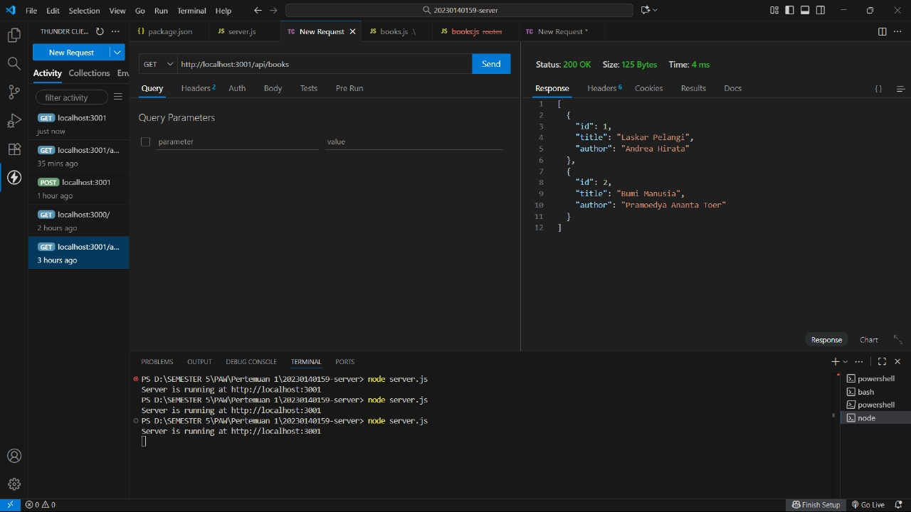
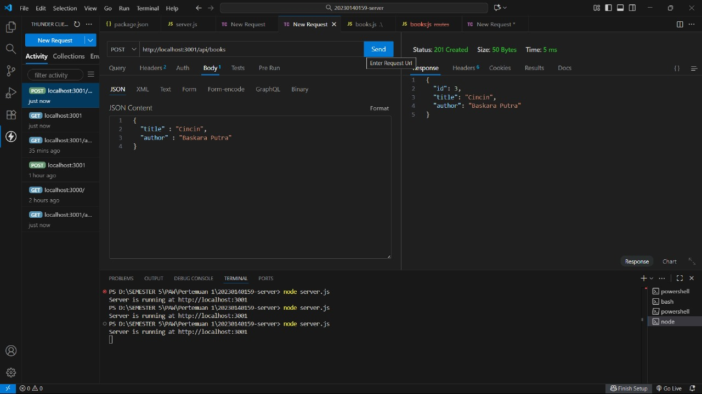
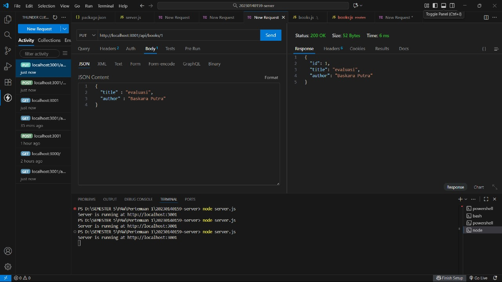

# Tugas 2 - Express.js CRUD Buku Perpustakaan

- *Nama:* Muhammad Dzulfikri
- *NIM:* 20230140159
- *Kelas:* D

## Endpoint CRUD

### 1. GET /api/books

### 2. GET /api/books/:id

### 3. POST /api/books

### 4. PUT /api/books/:id

### 5. DELETE /api/books/:id

### 6. AFTER DELETE /api/books/:id

